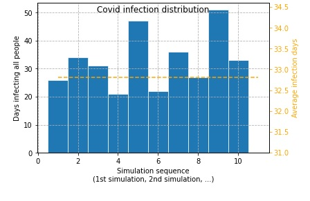

# Covid infection simulation
**Purpose**: A simple simulation of Covid infection that shows how many people get infected per day until all are infected.  

**Example**: 10 person in a room, one gets sick, given the parameter of how likely one is to pass it along to another person, how many days until they are all infected.   

**Input**: 
sizeOfSample = 10 #total number of people in sample 
infectionRate = 0.3 #probability of infecting one person a day, value range is [0,1) 
timesOfSimulation = 10 #how many times of the pandemic simulation 

**Output**:  Run the simulation over and over again to see average results and create a histogram of # days until pandemic ends.  

**Precondition**: The simulation is based on a constant infection rate no matter how many peole get infected.
But in reality, the more infected people, the more likely other people get infected.

**Solution**: &nbsp; python + jupyterlab + numpy + matplotlib
