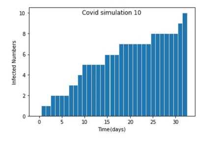

# Covid infection simulation
**Purpose**: A simple simulation of Covid infection that shows how many people get infected per day until all are infected.  

**Example**:  10 person in a room, one gets sick, given the parameter of how likely one is to pass it along to another person, how many days until they are all infected.  
**Input**:  
sizeOfSample = 10 #total number of people in sample  
infectionRate = 0.3 #probability of infecting one person a day, value range is [0,1)  
timesOfSimulation = 10 #how many times of the pandemic simulation  

**Output**:  
Run the simulation over and over again to see average results and create a histogram of # days until pandemic ends.  

**Precondition**:    
The simulation is based on a constant infection rate no matter how many peole get infected.  
But in reality, the more infected people, the more likely other people get infected.  

**Solution**: &nbsp; python + jupyterlab + numpy + matplotlib

**How to simulate:**  
1.Install jupyterlab  
2.Download notebook CovidSimulation.ipynb into your local folder and import it into your jupyterlab  
3.Modify the input parametes and run the notebook to do simulations  
